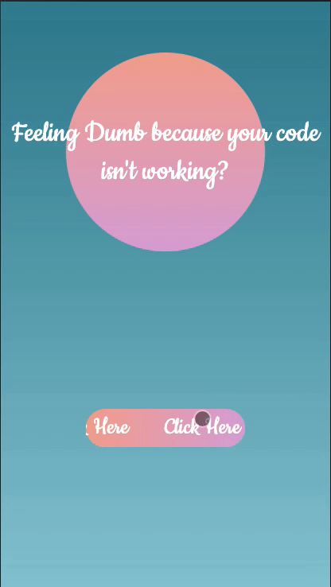

# feeling-dumb
A hackathon project utlizing the data from two public APIs to create app that generates two quotes for the user. sdf

## Technologies

- HTML
- CSS
- JavaScript
- jQuery AJAX
- Bootstrap 4

## Live Deployment to App

https://matthewweichen.github.io/feeling-dumb/

## Technologies

- HTML5
- CSS3
- Javascript
- jQuery
- Bootstrap 4

## Application Features

1. User can view selections.
2. User can select between Dumb or Inspirational quote
3. User can view selected quote
4. User can return home

## Preview

## Getting Started

Clone the repository.

    git clone https://github.com/MatthewWeiChen/feeling-dumb.git
    cd feeling-dumb

## The Server API

The server that your application will communicate with is:

1. https://tronalddump.io/random/quote
2. https://quote-garden.herokuapp.com/api/v2/quotes/random
